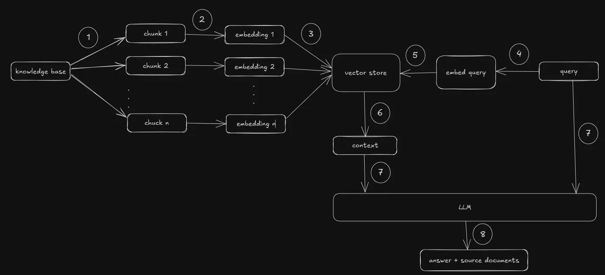

# Generative AI Fundamentals

## Generative AI
- Generative AI is a subset of artificial intelligence that creates content—such as text, images, audio, video, and code - in response to user prompts.
- Generative AI is making it easier to innovate faster and reduce the number of working hours needed for development.
- A **foundation model** is a large AI model trained on massive, diverse, unlabeled data (text, images, audio, etc.) that can be adapted (fine-tuned) to perform many different tasks.
- Foundational model types: Text-to-Text, Text-to-Embedding, Text-to-Multimodal, Multimodal-to-Multimodal

## LLM
- An LLM is an AI model trained on massive amounts of data, specialized in text understanding and generation. 
- E.g., OpenAI GPT, Anthropic Claude, Google Gemini 
- They understand queries and answer based on their training data.
- At their core, LLMs operate fundamentally as text-to-text systems. However, modern LLMs are no longer limited to text-to-text only. Many top models are now multimodal, meaning they can understand, process, and generate different types of media: image, audio, video

### Context window
- The context window of an LLM is the amount of text, in tokens, that the model can remember at any one time. This includes prompt, conversation history, and generated output. 
- When prompt + conversation exceeds an LLM’s context window, it must be truncated or summarized for the model to proceed.

### Temperature
- In a large language model (LLM), temperature is a parameter that controls how random or creative the model's output is,
- When an LLM predicts the next word, it assigns probabilities to possible choices.
- Low temperature (<1) makes the LLM select high-probability words; High temperature (>1) flattens the distribution, giving lower-probability words a better chance.
- Temperature = 0 → the model will always pick the most mathematically probable next word. Almost every time, you'll get the same answer. E.g. coding. maths
- Pushing the temperature too far beyond 1 or 1.5 often causes the model to generate factually incorrect text. E.g., fiction, poetry 
- Medium Temperature (0.3 to 0.7) provides a balanced mix of coherence and variety. This is typically the default setting for general conversational AI. E.g., emails, explanations.

### Top-k Sampling
- Only consider the top K most likely tokens after assigning probabilities. Ignore the rest.

### Top-p Sampling
- Instead of fixing the number of tokens as tok-k, it chooses the smallest set of tokens whose cumulative probability reaches p.

### Structured output
- Structured output in AI is a feature that forces models to return data in a strict, predictable format (like JSON or XML) instead of free-form text.

### Hallucination
- When unsure, LLMs often make up answers that sound right but aren’t factually correct. This is known as a hallucination. To overcome this:
     - Ground the Model with RAG
     - Adjust System Settings: Temperature, System instructions
     - Use prompt engineering
     - Use structured output and Implement Validation Checks

## Prompt engineering 
- Prompt engineering is the process of writing effective instructions for a model, such that it consistently generates content that meets your requirements.
     - Zero-shot prompting: You give the task directly, no examples. Example: Classify this review as positive or negative: "The product is amazing."
     - Few-shot prompting: You provide examples so the model learns the pattern. Example: Review: "Great phone" → Positive, Review: "Very slow device" → Negative, Review: "Battery lasts long" → ?
     - Role prompting (System-style framing): You assign a role to guide behavior. Example: You are a senior Java backend engineer. Explain microservices clearly.
     - Instruction clarity (Explicit prompting): Make tasks unambiguous. Bad: Explain APIs; Better: Explain REST APIs in 5 bullet points with a real-world example.
     - Constraint prompting: You restrict behavior. Example: Answer in under 50 words. Do not use technical jargon. Use only bullet points.
     - Context stuffing (RAG-style prompting): You provide relevant external knowledge inside the prompt.
     - ReAct prompting (Reason + Act): Model alternates between reasoning and tool use.

## Embeddings
- Computers can’t directly understand words, but they can work with numbers. A vector/embedding is an array of numbers. Each number in a vector captures some aspect of the meaning of the word or text.

### Vector store
- A vector database stores vectors (or embeddings) of texts alongside other metadata that can help identify, organize, or retrieve the relevant vector when performing searches.
- Each embedded text takes a place in vector space. When a query comes in, it is converted into vectors and placed in the same vector space. If the query vector is close to a document vector, it means the document is relevant to the question.
- E.g., Pinecone, Chroma, Milvus, FAISS
- For only thousands of vectors, in-memory libraries like FAISS are sufficient. However, for millions of vectors a distributed vector database is needed.

### Similarity Search
- Similarity search is the technique used to compute the distance between the vectors in vector space. Techniques: Cosine similarity, Dot product, Euclidean distance
- Semantic search uses vector embeddings + similarity search to find results based on meaning, not keywords.

## RAG


- Retrieval-Augmented Generation (RAG) is a technique that combines an LLM with an external knowledge base, instead of relying solely on the training data.
- They understand queries and answers based on an external knowledge base. 
- It pulls only the most relevant information from the knowledge base using vector stores and semantic search and inserts it into the context window of the LLM.
- RAG is preferred over frequent model retraining because updating documents is cheaper and faster than retraining a model.

### Naive RAG
- Documents are broken into chunks, each converted into embeddings and stored in a vector database. When a user asks a question, the question is embedded using the same embedding model used to embed documents, and the system finds the closest-matching text using similarity search and passes it to the LLM.

### Retrieve and Re-Rank
- The system first retrieves the top 20 matches. Then, a specialized model (called a cross-encoder) reorders them to ensure the top 3 are the most accurate.

###  HyDE (Hypothetical Document Embeddings)
- The LLM first writes a fake or hypothetical answer (imagine how the document looks) to the user's question. The system then converts this fake answer into a vector search to find the real documents.

### Self RAG
- Rewrite the user question to get better results.

### Graph RAG
- Instead of storing data as text in a vector database, this organizes information as a network of nodes and edges, which forms graph-structured data. When you ask a question, the LLM uses the graph to retrieve connected contexts.

### Agentic RAG
- The AI agent decides when to search, how many times to search, and what tools to use before giving the final answer.

### Chunking
- Chunking is the process of breaking large documents into smaller, meaningful pieces before storing them in the vector database.
- Larger chunks may return bloated context, miss the exact relevant part, and waste the context window.
- Too small chunks lose meaning, and retrieval may return fragments without enough information to answer.
     - Fixed-Size Chunking: Cuts text at a set number of characters (for example, 500 characters). It is fast but can cut sentences in half.
     - Semantic Chunking: Groups sentences by topic. The AI looks at the meaning and splits the text where the topic changes.
     - Document-Based Chunking: Splits text using the natural structure of your file, like a markdown header or a table row.
- Chunk Overlap: Repeat a small part of the previous chunk at the start of the new chunk to make sure no information is lost when a sentence is cut in half. A 10% to 20% overlap is common.

### RAG metrics
- Retrieval 
     - Recall@k – Are relevant documents retrieved within the top k results?
     - Precision@k – How many retrieved documents are actually relevant?
- Generation
     - Faithfulness: Measures whether the generated answer is strictly based on the retrieved documents.
     - Answer Relevancy: Measures whether the AI's answer is relevant to the user's question.
     - Answer Correctness: Compares the AI's final answer to a "ground truth"
     - Answer Completeness: Did the answer cover all required parts of the question, or did it give a partial response?

### Multi-turn conversations in RAG system
- Summarize the conversation, rewrite it into a standalone query, retrieve using that, and only keep the minimal relevant chat history in the prompt.

### Handling ambiguous or underspecified queries 
- [1] Before performing retrieval, use a lightweight LLM to detect if a query is clear. For example, if a user asks, "How do I reset the server?", the bot replies, "Which specific server model are you referring to?"
- [2] An LLM generates 2-3 differently worded questions from different perspectives if the user's question is unclear. These queries are run in parallel against your vector database.
- [3] The LLM rewrites the query based on chat history or generates a Hypothetical Document Embedding (HyDE)—a draft answer that helps the retriever find exact document matches.

### Prevent irrelevant context from polluting the prompt
- Apply metadata filters to narrow the search space
- Re-rank results after retrieval to push the best evidence to the top
- Set a minimum similarity threshold and drop weak matches

### Privacy or security risks exist in enterprise RAG systems
- Sensitive data leakage via retrieval (wrong user gets wrong docs)
- Unauthorized removal of data from modal
- Logging of private prompts/context
- Prompt injection from untrusted content

### RAG vs fine-tuning
- RAG: Adds external knowledge at query time; Fine-tuning: Updates internal knowledge of the model
- RAG: Fast, cheap, and easy to scale; Fine-tuning: Slow and expensive

### Best practices to debug RAG pipeline
- Instrument every stage of the RAG pipeline with detailed logs.
- Save retrieved document IDs, similarity scores, metrics, and the final prompt for each request.
- Maintain a benchmark evaluation dataset and run automated regression tests after updates.
- Add observability dashboards for latency, retrieval quality, hallucination rate, and user feedback.
- When something went wrong:
     - Check final context - Is context relevant? Context has too much unrelated stuff?
     - If context is not relevant, check similarity scores, chunkings, and rewritten query
     - If retrieval is correct, check temperature, used modal, and instructions
       
## Agent
- An AI agent is a technique that combines an LLM with tools that can think, plan, decide, and perform actions to achieve a goal. 

### Function Calling (Tool calling)
- Function calling is a mechanism that allows Large Language Models (LLMs) to connect to external systems and access data outside their training data.
     - The developer provides the LLM with a list of available functions, including their names, detailed descriptions, and input parameters formatted via JSON schema.
     - The user sends a prompt. The model detects that it cannot answer using its static training data alone
     - The model outputs a JSON payload matching the registered function schema instead of writing a conversational reply.
     - Your backend application parses this JSON response, executes the actual database query or API call, and retrieves the real-time data.
     - Your application sends the tool's raw result back to the model. The LLM reads this fresh context and outputs a natural, user-friendly response.

### Single-agent system
- A single-agent system means one AI agent is responsible for planning, reasoning, using tools, and completing a task through multiple steps.
- This can plan the sequence of actions and invoke one or more tools as needed.

### Multi-Agent System
- A multi-agent system combines multiple AI agents, each with a specialized role.
- Even though a single-agent system can plan and invoke multiple tools, that doesn’t mean it’s always the best architecture. Architecture can become complex when too many responsibilities are mixed or the context window is exceeded. So, a multi-agent system solves this by delegating roles to specialized agents.

#### Sequential Pipeline Architecture
- Agents are arranged sequentially.
```
Agent A → Agent B → Agent C → Agent D
```

#### Router-Based Architecture
- A router agent decides which worker agent should handle the task, collects the results, and returns it.
- The router agent calls only one agent to complete a task.
```
                     Router Agent
                          │
     ┌────────────────────┼──────────────────┐
     ▼                    ▼                  ▼
 Worker Agent 1     Worker Agent 2    Worker Agent 3
```

#### Hierarchical Architecture
- Unlike the router agent, the manager agent breaks down the task, assigns subtasks across multiple worker agents, collects results, and produces final output.
```
                     Manager Agent
                          │
     ┌────────────────────┼──────────────────┐
     ▼                    ▼                  ▼
 Worker Agent 1     Worker Agent 2    Worker Agent 3
```

#### Graph Architecture
- Agents are connected by predefined edges, and execution moves between agents according to a predefined workflow and conditional routing rules.
```
A → Yes → B → No → C
│         │
▼         ▼
No        Yes
│         │
▼         ▼
D → → E → F
```

#### Network Architecture
- Each agent can talk to any other agent in the whole collection. No predefined workflow
```
A ↔ B ↔ C
↕   ↕   ↕
D ↔ E ↔ F
```

### Planning/Task decomposition
- Task decomposition is the process of breaking a complex user request into smaller, manageable subtasks that an AI agent (or multiple agents) can execute step by step.
- Either a single agent can decompose tasks internally and execute them step by step itself, or a manager agent can decompose tasks and exuceute then by calling worker agents.
- The subtasks can be run sequentially or simultaneously.
- The planning can be built by an LLM during runtime, or it can be predefined by developers (e.g., using LangGraph)

### Memory
- Memory allows an AI agent to retain and reuse information instead of treating every request independently.
- Short-term memory: Stores the current conversation, intermediate results, and workflow state
- Long-term memory: Persists user preferences or important facts and past events over weeks or months.
- During an agentic workflow, the agent reads relevant memory before planning or using tools, and updates memory with new information after generating the response.
- This enables personalized interactions, avoids redundant work, and supports multi-step reasoning.

### Reflection
- Reflection is the process where an AI agent reviews its own intermediate or final output before responding to the user.
- During reflection, the agent checks whether the answer is correct, complete, grounded in available evidence, and consistent with the user's instructions.
- If it finds issues, it can revise the answer or even perform additional actions, such as calling another tool or retrieving more information.
- Reflection is implemented as an additional reasoning step rather than a built-in LLM capability. After generating an initial answer, the application prompts the LLM (Reflection agent) to review its own output against criteria such as accuracy, completeness, grounding, and instruction following. If the review identifies issues, the workflow loops back to revise the answer or perform additional tool calls.
- Reflection improves response quality and reliability, but it also increases latency and cost because it requires additional reasoning steps.

### Human-in-the-Loop (HITL)
- Human-in-the-Loop (HITL) is an AI workflow where a human participates in the decision-making process instead of letting the AI act completely on its own.
- Without HITL: AI decides → AI acts.
- With HITL: AI suggests → Human reviews/approves/edits → AI continues.
- Human-in-the-Loop is often implemented by pausing the workflow before a critical action. The agent waits for user approval, and once the user responds, the workflow resumes from that point.

## MCP
- The Model Context Protocol (MCP) is an open standard that connects AI models to external tools (i.e., GitHub, Gmail, Calendar), eliminating the need for custom integrations between every AI application and every external system.
- The three main components of MCP are Host, Client, and Server.
- **MCP Host** is the application that the user interacts with. E.g., A chatbot application
- The **MCP Client** is integrated with the MCP Host and communicates with MCP servers using the MCP protocol. It's responsible includes connecting to MCP servers, discovering available tools, sending tool requests, receiving results, and returning results to the Host
- The implementation of the tools resides in the **MCP Server**, which is developed and maintained by the relevant external system or service provider. For example, a GitHub MCP Server exposes tools such as create_issue, merge_pr, search_repo, and get_pull_requests. When an MCP client invokes one of these tools, the MCP Server executes the corresponding GitHub API calls and returns the results.

## LangChain/LangGraph
- LangChain and LangGraph are abstraction layers that simplify AI development by providing prebuilt components. 


